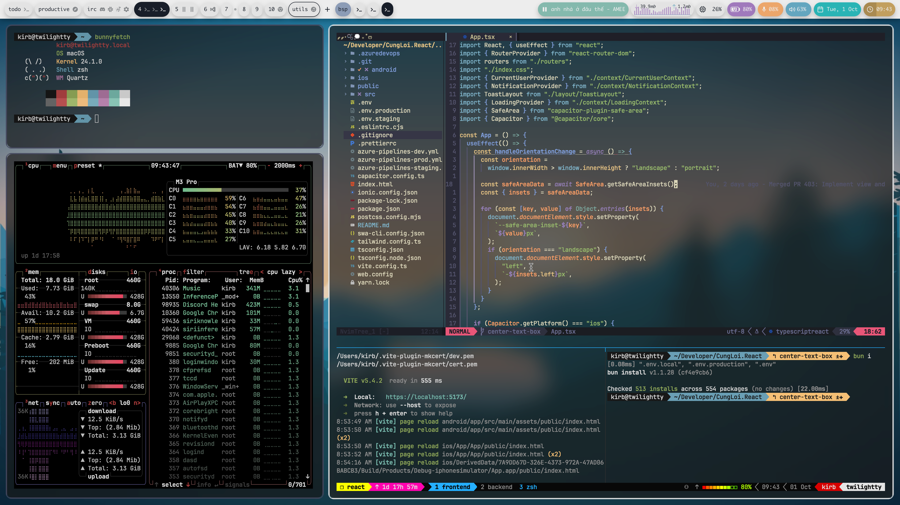

# My dotfiles (built on 03/15/2024)

## Build and install

```bash
# for macos
darwin-rebuild switch --flake .

# for linux
home-manager switch --flake .#kirb
cd ./linux/sysconfig && sudo nixos-rebuild switch --flake .
```

> [!TIP]
> Enable [Cachix](https://www.cachix.org/) to use binary instead of compiling stuff on your own

## Explaination

```
- macos/: macos config stuff
- linux/: linux setup
- shared/: used for both linux and macos

# dig into the folder to see what's going on :)
```

Screenshots of macOS and Linux environment



wallpapers belong to the computer clan
