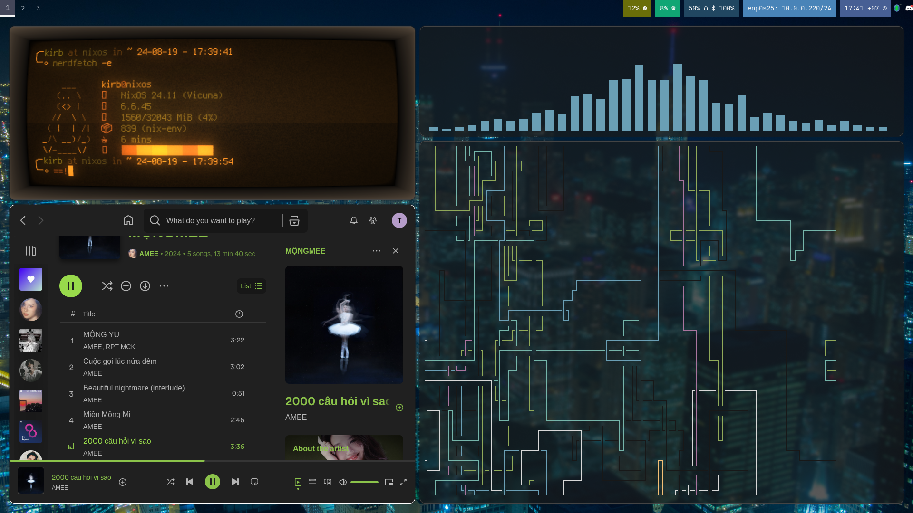

# My dotfiles (built on 03/15/2024)

## Build and install
```bash
# for macos
darwin-rebuild switch --flake .

# for linux 
home-manager switch --flake .#kirb
```

## Explaination
```
- macos/: macos config stuff
- linux/: linux setup

# dig into the folder to see what's going on :)
```
Screenshots of macOS and Linux environment




wallpapers belong to the computer clan
